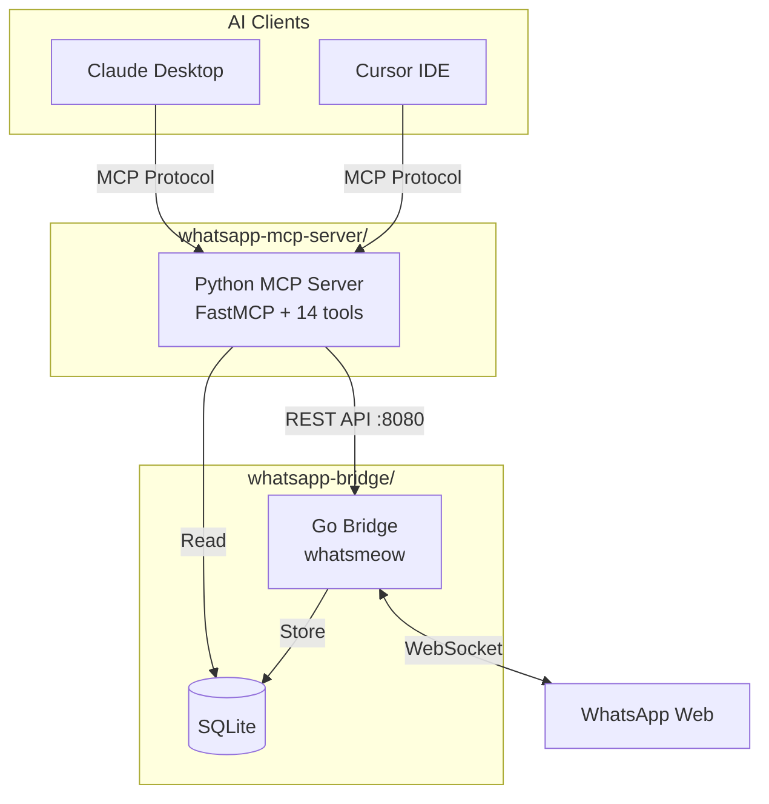

# CLAUDE.md

This file provides guidance to Claude Code (claude.ai/code) when working with code in this repository.

## Repository Purpose

This is the **whatsapp-mcp** repository - a Model Context Protocol (MCP) server for WhatsApp messaging. It enables Claude and other MCP clients to read, search, and send WhatsApp messages.

Originally forked from [lharries/whatsapp-mcp](https://github.com/lharries/whatsapp-mcp), now maintained by [Very Good Plugins](https://verygoodplugins.com/?utm_source=github).

## Architecture



**Two Components:**

1. **Go Bridge** (`whatsapp-bridge/`) - Connects to WhatsApp Web
   - REST API: `/api/send`, `/api/download`, `/api/health`, `/api/typing`
   - Stores messages in SQLite (`store/messages.db`)
   - Forwards incoming messages via webhook

2. **Python MCP Server** (`whatsapp-mcp-server/`) - Exposes 14 MCP tools
   - Reads from SQLite for message/contact queries
   - Calls Go bridge REST API for actions (send, download)

## Project Structure

```
whatsapp-mcp/
├── whatsapp-bridge/           # Go bridge (WhatsApp Web connection)
│   ├── main.go                # Main bridge application (~1500 lines)
│   ├── webhook.go             # Webhook handler for incoming messages
│   ├── go.mod / go.sum        # Go dependencies
│   ├── .golangci.yml          # Linter config
│   └── store/                 # SQLite database + media (gitignored)
├── whatsapp-mcp-server/       # Python MCP server
│   ├── main.py                # FastMCP server with 14 tools
│   ├── whatsapp.py            # Core logic and database queries
│   ├── audio.py               # FFmpeg audio conversion utilities
│   ├── tests/                 # pytest tests
│   └── pyproject.toml         # Python dependencies
├── .github/workflows/         # CI/CD pipelines
│   ├── ci.yml                 # Lint + test on PR
│   └── security.yml           # Weekly security scans
└── .env.example               # Environment variable template
```

## Common Commands

```bash
# Start Go bridge (scan QR code to authenticate)
cd whatsapp-bridge
go run main.go

# Or build and run binary
go build -o whatsapp-bridge && ./whatsapp-bridge

# Run Python MCP server
cd whatsapp-mcp-server
uv run main.py

# Run tests
cd whatsapp-mcp-server
uv run pytest -v

# Lint Python
cd whatsapp-mcp-server
uv run ruff check .
uv run ruff format .

# Lint Go
cd whatsapp-bridge
golangci-lint run
```

## Environment Variables

| Variable | Default | Description |
|----------|---------|-------------|
| `WHATSAPP_DB_PATH` | `../whatsapp-bridge/store/messages.db` | SQLite database path |
| `WHATSAPP_API_URL` | `http://localhost:8080/api` | Go bridge REST API |
| `WHATSAPP_BRIDGE_PORT` | `8080` | Go bridge port |
| `WEBHOOK_URL` | `http://localhost:8769/whatsapp/webhook` | Incoming message webhook |
| `FORWARD_SELF` | `false` | Forward self-sent messages |

## Key Files to Modify

| File | Purpose |
|------|---------|
| `whatsapp-mcp-server/main.py` | MCP tool definitions (add/modify tools here) |
| `whatsapp-mcp-server/whatsapp.py` | Database queries and data conversion |
| `whatsapp-bridge/main.go` | REST API endpoints and WhatsApp connection |
| `whatsapp-bridge/webhook.go` | Incoming message webhook handler |

## MCP Tools (14 total)

**Contact Tools:**
- `search_contacts` - Search by name or phone
- `get_contact` - Resolve phone → name

**Message Tools:**
- `list_messages` - Query messages with filters (limit, date range, sort)
- `send_message` - Send text message
- `get_message_context` - Get messages around a specific message

**Chat Tools:**
- `list_chats` - List all chats
- `get_chat` - Get chat by JID
- `get_direct_chat_by_contact` - Find DM with contact
- `get_contact_chats` - All chats with a contact
- `get_last_interaction` - Last message with contact

**Media Tools:**
- `send_file` - Send image/video/document
- `send_audio_message` - Send voice message (auto-converts to Opus)
- `download_media` - Download media from message

## Gotchas

1. **JID Format**: WhatsApp IDs are JIDs like `1234567890@s.whatsapp.net` (DM) or `123456@g.us` (group)

2. **Media Files**: Stored in `store/{sender_jid}/` directories with timestamp-based filenames

3. **Database Schema**: SQLite with `messages` and `chats` tables
   - Messages: id, chat_jid, sender, content, timestamp, is_from_me, media_type, filename
   - Chats: jid, push_name, last_message_time

4. **Audio Format**: Voice messages must be Opus .ogg format - FFmpeg auto-converts

5. **Sender Display**: Messages include `sender_display` field showing "Name (phone)" for agent clarity

## Testing

```bash
cd whatsapp-mcp-server
uv run pytest -v
```

Tests cover:
- Message conversion (`msg_to_dict`)
- Chat conversion
- Contact resolution

## CI/CD

- **ci.yml**: Runs on every PR
  - Python lint (ruff)
  - Python tests (pytest)
  - Go lint (golangci-lint)
  - Go build

- **security.yml**: Weekly security scans
  - CodeQL analysis
  - Dependency audit (pip-audit, bandit)

## Commit Message Format

Use conventional commits for release-please:
- `feat:` → minor version bump
- `fix:` → patch version bump
- `feat!:` or `BREAKING CHANGE:` → major version bump
- `chore:`, `docs:` → no version bump
