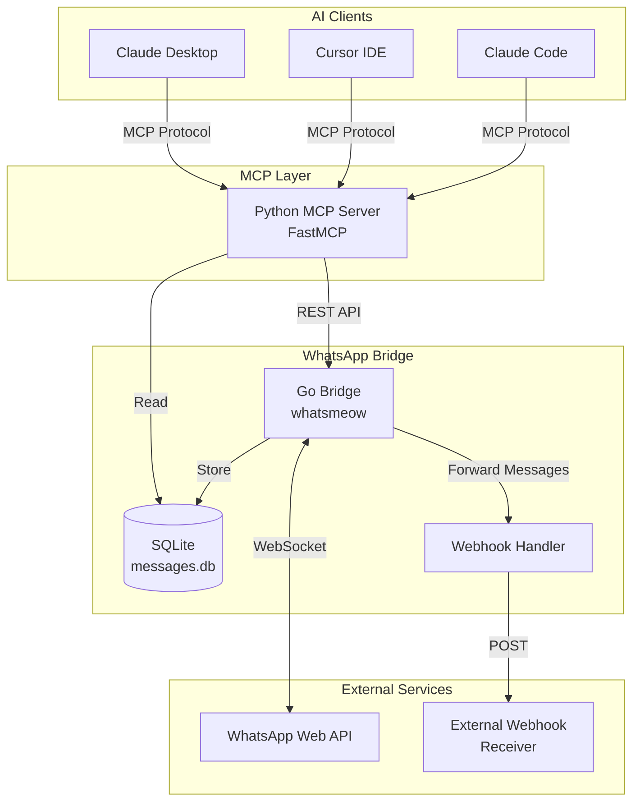
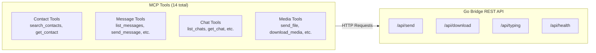
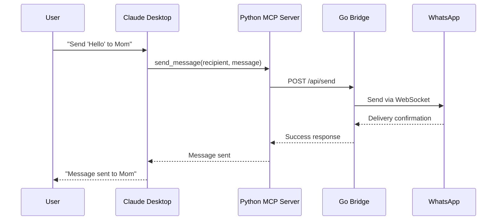
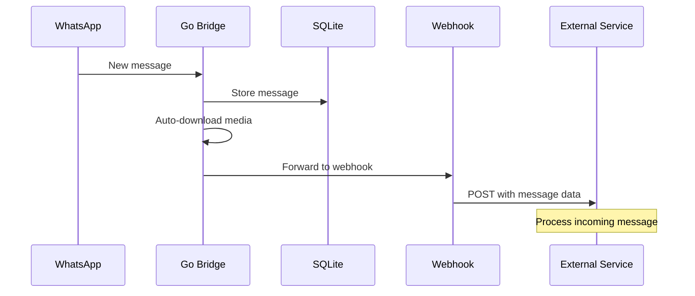

# WhatsApp MCP Server

[](https://github.com/verygoodplugins/whatsapp-mcp/actions/workflows/ci.yml)
[](https://opensource.org/licenses/MIT)
[](https://www.python.org/downloads/)
[](https://go.dev/)

A Model Context Protocol (MCP) server for WhatsApp, enabling Claude to read and send WhatsApp messages.

> Originally created by [Luke Harries](https://github.com/lharries/whatsapp-mcp). Maintained by [Very Good Plugins](https://verygoodplugins.com/?utm_source=github).

## Features

- **Message Management**: Search and read personal WhatsApp messages (text, images, videos, documents, audio)
- **Contact Search**: Search contacts by name or phone number with `sender_display` format ("Name (phone)")
- **Send Messages**: Send text messages to individuals or groups
- **Media Support**: Send and download images, videos, documents, and voice messages
- **Webhook Integration**: Forward incoming messages to external services
- **Local Storage**: All messages stored locally in SQLite - only sent to Claude when you allow it

## Installation

### Prerequisites

- Go 1.24+
- Python 3.11+
- [uv](https://docs.astral.sh/uv/) package manager
- Claude Desktop or Cursor
- FFmpeg (optional, for voice message conversion)

### Quick Start

1. **Clone the repository**

   ```bash
   git clone https://github.com/verygoodplugins/whatsapp-mcp.git
   cd whatsapp-mcp
   ```

2. **Start the WhatsApp bridge**

   ```bash
   cd whatsapp-bridge
   go run main.go
   ```

   Scan the QR code with WhatsApp on your phone to authenticate.

3. **Configure Claude Desktop**

   Add to `~/Library/Application Support/Claude/claude_desktop_config.json`:

   ```json
   {
     "mcpServers": {
       "whatsapp": {
         "command": "uv",
         "args": [
           "--directory",
           "/path/to/whatsapp-mcp/whatsapp-mcp-server",
           "run",
           "main.py"
         ]
       }
     }
   }
   ```

   Replace `/path/to/whatsapp-mcp` with your actual path.

4. **Restart Claude Desktop**

### Cursor IDE Configuration

Add to your Cursor MCP settings (`~/.cursor/mcp.json`):

```json
{
  "mcp": {
    "servers": {
      "whatsapp": {
        "command": "uv",
        "args": [
          "--directory",
          "/path/to/whatsapp-mcp/whatsapp-mcp-server",
          "run",
          "main.py"
        ]
      }
    }
  }
}
```

## Tools

Messages include `sender_display` showing "Name (phone)" format for easy identification by agents.

### Contact Operations

#### `search_contacts`

Search contacts by name or phone number.

**Parameters:**
- `query` (required): Name or phone number to search

**Natural Language Examples:**
- "Find contacts named John"
- "Search for phone number 555-1234"
- "Who has the phone number starting with +1?"

#### `get_contact`

Resolve a WhatsApp contact name from a phone number, LID, or full JID.

**Parameters:**
- `identifier` (required): Phone number, LID, or full JID (aliases: `phone_number`, `phone`)
  - Examples: `12025551234`, `184125298348272`, `12025551234@s.whatsapp.net`, `184125298348272@lid`

**Natural Language Examples:**
- "What's the name for phone number 5551234567?"
- "Look up who owns this number"
- "Who is 184125298348272@lid?"

### Message Operations

#### `list_messages`

Get messages with filters, date ranges, and sorting.

**Parameters:**
- `chat_jid` (optional): Filter by specific chat JID
- `limit` (optional): Number of messages (default 50, max 500)
- `before_date` (optional): Messages before this date (YYYY-MM-DD)
- `after_date` (optional): Messages after this date (YYYY-MM-DD)
- `sort_by` (optional): "newest" or "oldest" (default "newest")

**Natural Language Examples:**
- "Show me the last 100 messages from today"
- "Get messages from the family group chat"
- "Find messages from last week"

#### `send_message`

Send a text message to a contact or group.

**Parameters:**
- `recipient` (required): Phone number or group JID
- `message` (required): Text content to send

**Natural Language Examples:**
- "Send 'Hello!' to +1234567890"
- "Message the team group saying 'Meeting at 3pm'"

#### `send_file`

Send a media file (image, video, document).

**Parameters:**
- `recipient` (required): Phone number or group JID
- `file_path` (required): Path to the file
- `caption` (optional): Caption for the media

#### `send_audio_message`

Send a voice message (automatically converts to Opus .ogg format).

**Parameters:**
- `recipient` (required): Phone number or group JID
- `file_path` (required): Path to audio file

#### `download_media`

Download media from a received message.

**Parameters:**
- `message_id` (required): ID of the message with media
- `chat_jid` (required): JID of the chat containing the message

### Chat Operations

#### `list_chats`

List all chats with metadata.

**Parameters:**
- `limit` (optional): Number of chats (default 50, max 200)

#### `get_chat`

Get specific chat metadata by JID.

**Parameters:**
- `jid` (required): Chat JID

#### `get_direct_chat_by_contact`

Find a direct message chat with a contact.

**Parameters:**
- `phone` (required): Phone number of the contact

#### `get_contact_chats`

List all chats involving a specific contact.

**Parameters:**
- `phone` (required): Phone number of the contact

#### `get_last_interaction`

Get the last message exchanged with a contact.

**Parameters:**
- `phone` (required): Phone number of the contact

#### `get_message_context`

Get messages around a specific message for context.

**Parameters:**
- `message_id` (required): ID of the target message
- `chat_jid` (required): JID of the chat
- `before` (optional): Number of messages before (default 5)
- `after` (optional): Number of messages after (default 5)

## Configuration

Copy `.env.example` to `.env` and configure as needed:

| Variable | Default | Description |
|----------|---------|-------------|
| `WHATSAPP_BRIDGE_PORT` | `8080` | Port for Go bridge REST API |
| `WEBHOOK_URL` | `http://localhost:8769/whatsapp/webhook` | Webhook for incoming messages |
| `FORWARD_SELF` | `false` | Forward messages sent by self |
| `WHATSAPP_DB_PATH` | `../whatsapp-bridge/store/messages.db` | Path to SQLite database |
| `WHATSAPP_API_URL` | `http://localhost:8080/api` | Go bridge REST API URL |

## Architecture



### Component Details



### Data Flow



### Incoming Message Flow



## Development

### Running Tests

```bash
cd whatsapp-mcp-server
uv pip install -e ".[dev]"
uv run pytest -v
```

### Linting

```bash
# Python
cd whatsapp-mcp-server
uv run ruff check .
uv run ruff format .

# Go
cd whatsapp-bridge
golangci-lint run
```

### Building

```bash
# Go bridge
cd whatsapp-bridge
go build -o whatsapp-bridge

# Run the binary
./whatsapp-bridge
```

## Troubleshooting

### Authentication Issues

- **QR Code Not Displaying**: Restart the bridge. Check terminal QR code support.
- **Device Limit Reached**: Remove a linked device from WhatsApp Settings > Linked Devices.
- **No Messages Loading**: Initial sync can take several minutes for large chat histories.
- **Out of Sync**: Delete `whatsapp-bridge/store/*.db` files and re-authenticate.

### Windows

Windows requires CGO for go-sqlite3. Install [MSYS2](https://www.msys2.org/) and enable CGO:

```bash
go env -w CGO_ENABLED=1
go run main.go
```

## Security Notice

> **Caution**: As with many MCP servers, this is subject to [the lethal trifecta](https://simonwillison.net/2025/Jun/16/the-lethal-trifecta/). Prompt injection could lead to private data exfiltration. Use with awareness.

## License

MIT License - see [LICENSE](LICENSE) for details.

## Credits & History

This project is a maintained fork of [lharries/whatsapp-mcp](https://github.com/lharries/whatsapp-mcp), originally created by [Luke Harries](https://github.com/lharries).

**Why we forked:** The original repository hasn't been updated since April 2025. We needed continued maintenance, bug fixes, and new features for production use.

**What we changed:**

- Added `/api/typing` endpoint for typing indicators
- Added `/api/health` endpoint for connection status
- Added webhook system for incoming messages (with reply context)
- Added auto-download of media files
- Added `get_contact` tool for phone → name resolution
- Added `sender_display` field showing "Name (phone)" format
- Improved message querying (sorting, larger batches up to 500)
- Fixed compilation issues from whatsmeow API changes
- Fixed media filename consistency (uses message timestamp)
- Added CI/CD pipeline with GitHub Actions

We're grateful to Luke for creating the original project!

## Links

- [Very Good Plugins](https://verygoodplugins.com/?utm_source=github)
- [MCP Specification](https://modelcontextprotocol.io/)
- [whatsmeow](https://github.com/tulir/whatsmeow) - WhatsApp Web API library for Go
- [FastMCP](https://github.com/jlowin/fastmcp) - Fast Model Context Protocol implementation
